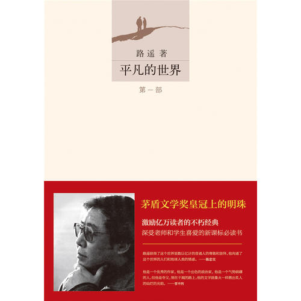
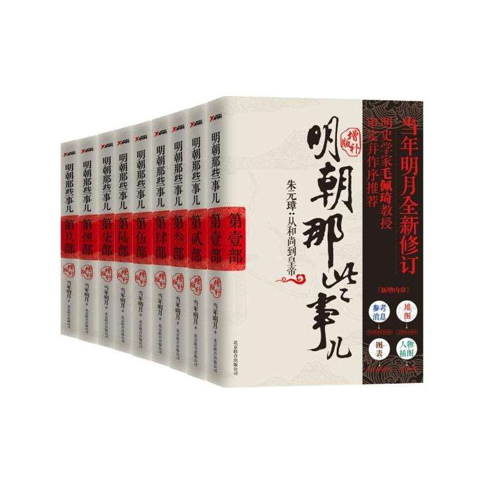
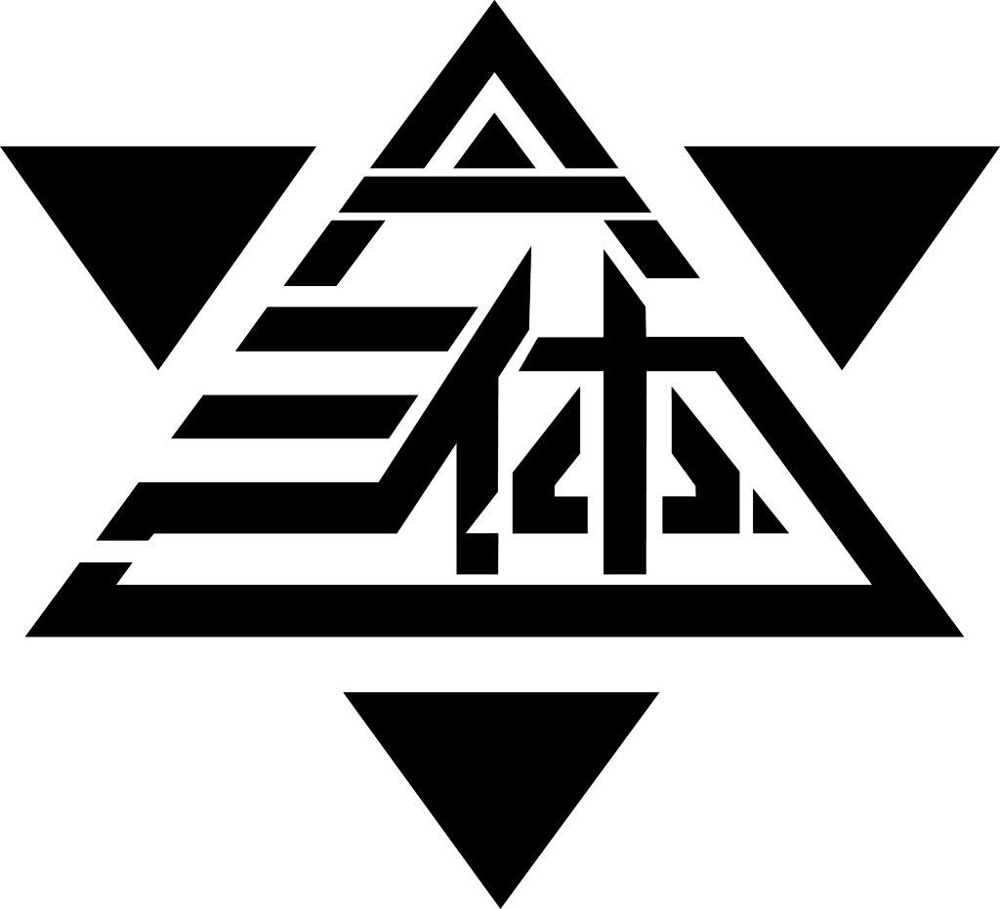

# 对我影响比较大的书

## 1  《平凡的世界》
　　

毫不夸张地说,平凡的世界很能激励人心,特别是第二部,当时在高三坚持不下去时就会想起在百米深的煤矿下干活的孙少平,高三这点苦又算得了什么!

平凡,是生活的本色。我们每一个人，对于这个浩缈的世界来说，都十分渺小、脆弱、微不足道。这个世界也是平凡的，悲与欢、生与死、穷与富、世事的变更，于历史的长河来说，无非是些平凡事。对于平凡，我素来都是这样认为的，直到读了一本书——《平凡的世界》，这才恍然大悟。 

这一部伟大的巨著，为我们解说了平凡和苦难，阐释了生活的意义。书中为我们描述的是一个平凡的世界，一个黄土地上的世界。这里生活着一群世世代代面朝黄土北朝天的普通人，他们演绎着一幕幕生老病死、悲欢离合、贫穷与富裕、苦难与拼搏、世事变更的戏剧。是喜剧？悲剧？正剧？也许都有一点。在这本书里，没有华丽的辞藻、没有惊险离奇的情节，没有惊天动地的场面，有的只是平凡的人,平凡的生活,平凡的感情,平凡的故事。 

老师推荐我读这本书的时候，我还以为她是在搪塞我，因为我读完第一遍的时候，我没有任何感觉，这里面的事情太平凡了，平凡得让我感觉到他们都好像是发生在我的身边。然而，当我读到第三遍的时候，我已经感觉到了我的血液慢慢地开始沸腾了。 

书中给我印象最深的人物是孙少平。这是一位对苦难有着深切的认识，对生活有着深邃的理解，对精神世界有着深刻追求的人，他有铮铮铁骨，有强大的精神力量，有巨大的勇气。从学生时代的"非洲人"到成年时代的"揽工汉"，他经历的是艰苦卓绝的人生奋斗，然而在痛苦与磨砺中，他形成了一种对苦难的骄傲感、崇高感。我欣赏他的苦难的哲学，钦佩他对劳动的认识，羡慕他对生活的理解。 

关于苦难的哲学，书中这样表达"……是的，他是在社会的最底层挣扎，为了几个钱而受尽折磨；但是他已经不仅仅将此看作是谋生、活命……他现在倒很“热爱”自己的苦难。通过这一段血火般的洗礼，他相信，自己经历千辛万苦而酿造出来的生活之蜜，肯定比轻而易举拿来的更有滋味——他自嘲地把自己的这种认识叫做‘关于苦难的学说’……"这是一种什么样的认识啊？每到我们遇到困难、挫折的时候——也许这种困难与挫折只有孙少平所遭受的苦难的百万分之一——我们可曾有过这样的认识？就算是哪天放学是下了场雨，亦或是天气有些闷热而又停了电，我们往往会听到许多的怨天尤人。然而，我想只要是你读了《平凡的世界》以后，读懂了“苦难的哲学”，那么就算是你今后遭受再多的苦难，你也不会怨天尤人。 

对于劳动的认识，书中这样写道：“一个人精神是否充实，或者说活得有无意义，主要取决于他对劳动的态度。”这绝对是一条精辟的理论，在任何时候都不会过时的理论。“只有劳动才可能使人在生活中强大。无论什么人，最终还是要那些能用双手创造生活的劳动者。对于这些人来说，孙少平给他们上了生平最重要的一课——如何对待劳动，这是人生最基本的课题。”这里体现出的是两种人，勤劳的和懒散的。人生来是没有差别的，然而经过了不同的境遇和发展之后，人与人之间便产生了巨大的差别。而在这期间，对于劳动的认识不同，对产生这样的差别起着决定性的作用。 

正如我们考到大学的时候，在学习方面，我们没有太多的差别。然而，经历了三年的大学生活之后，人与人之间的差别又是何其巨大。宰相刘罗锅在和绅临终前对他说：“其实，每个人的结局，都是他自己一手精心设计的。”当我们读到这里的时候，我们都应当好好想想，我们是怎样对待劳动的。 
孙少平，到底是一个什么样的人啊。其实，他也就是一个平平凡凡的人，一个比普通农民多读了几本书，一个对生活的意义有着更高层次追求的人。在写给妹妹孙兰香的信中充分表现了他对生活的认识： 

“……我们出生于贫苦的农民家庭——永远不要鄙薄我们的出身，它给我们带来的好处将使我们一生受用不尽；但我们一定又要从我们出身的局限中解脱出来，从意识上彻底背叛农民的狭隘性，追求更高的生活意义。…… 

首先要自强自立，勇敢地面对我们不熟悉的世界。不要怕苦难！如果能深刻理解苦难，苦难就会给人带来崇高感。……如果生活需要你忍受痛苦，你一定要咬紧牙关坚持下去。有位了不起的人说过：痛苦难道会是白受的吗？它应该使我们伟大！什么是平凡？那种迷失在平凡的生活之中，眼中熟悉了平淡，思想上甘于平庸，生活上安于现状的人，才是真正的平凡。孙少平这样一个对生活的意义有着更高追求的人，又怎能称之为平凡的人。即使是平凡，也是一个更高层次的伟大的平凡

### 2<明朝那些事>

一个老师曾经教导我读书要泛读,历史 哲学 等都可涉略.毫无疑问,明朝那些事儿是我唯一一套喜欢并且对我产生影响的历史书!

《明朝那些事儿》读后感(一)：王朝剪影
　　作为一本想要了解明朝的入门书，这是一套很好的故事集。重要的人物，都在书里。但是，每每读过，总是感觉意犹未尽——对很多人和事的描写，过于简略。
　　我想看历史，就是看人、看事、看理。这与马未都的历史不可能还原，以及作者强调历史规律，有些相似——历史的真相，是很难追溯的，但历史的道理，是永恒存在的。天下事无新鲜事，发生过的还会再发生。
　　这套书写人，是很有意思的。像朱元璋，每每要杀人的时候，作者总会写道：“要么不做，要么做绝”。就这八个字，其实朱元璋的很大一部分性格，已经展现眼前。其实这种极端的性格，我是很理解的，年岁日长，越觉得中庸之难；而成大事者，有着一副中庸之态，则更是难上加难。
　　朱允炆是个好人，也是个悲剧。所谓好人，大概和心软之类的连在一起，但心软似乎也不等于与人为善。朱允炆的削藩，似乎也没有和当年与朱元璋对话时说的那样：先礼劝诸王，不听则惩罚他们；相反，朱允炆不告警而直接下手，并且丝毫不手软。我想，朱允炆是输在了年幼，输在了幼稚。比起朱棣，似乎这位皇帝，更适合当一个与世无争的王爷。
　　朱棣似乎不是好人，但朱棣是有能力的领导者。自然选择，会选出最适合的物种——也许有些时候有些运气的成分。朱棣是自然选择的产物，自然比温室花朵朱允炆有战斗力的多。作者对于朱棣的评价，还是很中肯的——朱棣有两张面孔，对敌人狠，对自己人慈。我想，这种处事方式，似乎十分现代——以自我为中心，有利于自己的，合作；不利于自己的，消灭。从这一点来看，朱棣其实很真实。再反过来看看，越是高位的人，经常越活的自我；而越是普通民众，似乎越来越高尚——而这种高尚，倾向于虚假。
　　从万历中期之后，内容偏向于无聊。并不是作者写的不好，而是历史偏向于无聊——边境忧患成为常态，却再没有充满想象力而又左右战局的大将；朝中也没有尝试改变的变革能臣。整个帝国，似乎除了党争，就是党争。像极了一出永远没有结局的烂戏，剧情整日不变，只是上台的演员，换了一批又一批。为什么朱元璋、朱棣这样的早期君王，设计的制衡机制，远不如美国那样有效呢？为什么后来，帝权、相权、宦权总是此消彼长，却很难为一个目标而共同努力呢？我想，差距不在于顶层，而在于底层——明朝的普通民众，是和朝廷没有关系的，只是一群蝼蚁，无论上层如何变，底层变化是不大的；但美国，人民的权力似乎很有力量，至少表面上，还是可以影响政局的（比如通过选举）。
　　《明朝那些事儿》读后感(二)：一个王朝的背影——颠扑不破的气数
　　第二次读《明朝那些事儿》是从第四本开始的，也就是嘉靖时代，明朝自此开始由盛转衰，一周多的时间读完四本书便没有心力一篇一篇写了，索性直接写在这里。 这套书已经不需要再帮他吹嘘什么，因为已经经得起市场的检验了，豆瓣评分也高于9.1，我自己也是给打了10分。但是要把缺点放在前面说——先抑后扬。第一，由于整套书的语言太过接地气，太像讲故事，就像在看一本相声书籍一样，所以读过之后只能对故事有一个大致的了解，但是真要拿出去讲恐怕还是有点心虚。第二，作者太向着明朝了，以至于除了在读魏忠贤咬牙切齿之外，其他的时候就是感觉明朝不该亡，就像作者自己总结的，气数已尽是崇祯皇帝不可避免的命运，这样实在有些说不过去，可以说读到最后稀里糊涂的明朝就亡了。 以上是鸡蛋里挑骨头。 客观的讲，能挑出以上两方面的毛病，是因为作者实在是读了太多的史书，感觉市面上能找到的资料貌似作者都有了解，所以经常会出现几个版本的故事同事陈列出来，越到后来越夸张，经常是说着说着就来一句“是这样么，不是”。作者对于明史是有自己的判断的，他通过历史资料的蛛丝马迹进行整理判断，对人对事进行大胆的评价，所以作者展示出的明朝是一个不一样的明朝，不知道有多少演绎的成分在，但是作为读者总体感觉酣畅淋漓。 ------------------分割线----------------- 现在开始讲正题。 一个王朝的背影是余秋雨先生的一本书，从木兰围场开始讲清朝的命运。所谓王朝的背影，也就是后人在评述历史的时候站在至高无上的帝王背后看到的真相与规则，对于帝王本人而言，他们可以操控帝国的走向，但是却永远没有机会看到这背影。 明朝是中国从世界超级大国开始被渐渐超越的时代，这是我的视角。明朝的背影确实是繁华的，无数先人留下的璀璨的文化光耀至今，但是中国历代发展至明朝已经形成了稳定的模式，使得这200余年的帝国仍然逃不出历史的宿命，在权力和利益的博弈中，将人性和权谋发挥到极致并未推动历史的进步，仅仅支撑了历史向前走。所以，最后来看，固有的模式的蜕变总要有着外在的刺激和激励，但是当我们回眸明朝的背影，看到的是企图操控一切的道士嘉靖，是后半生无所作为的万历，直到渴望励精图治却感慨诸臣误我的崇祯。在这样的历史进程中，有忠骨、有巨奸，但是他们都在这逃不出的围城中博弈着。这围城之外的人，努力进入围城之中，最终铸就更宏伟的围城，这就是一代代王朝的背影，因为在个过程中，我们从未看到有人从围城中主动走出，历史呈现给我们的只有背影。 正是在这样的命运之下，辉煌的文化最终演变成了屈辱的历史，一代代天才全都将命运奉献给了王朝的兴衰，而每个人都为了皇上身边服务的机会而机关算尽，在明朝，都难逃言官的祸害和斗争的残酷。即使张居正在死后也难逃劫难。我曾无数次疑惑，难道明辨忠奸是这样难的一件事么，读着读着发现，当所有的一切可以不分黑白，所有的进言中夹杂着真相和谎言，即使在权力的顶端也难以分辨，这是一个从皇权视角无法解决的问题，能够解决这一问题的只有制度，但是一切制度却又是为了皇权服务，最终进一步巩固皇权，所以循环往复，中国的帝制到了明朝，越是看起来到了鼎盛，越是注定了最后的衰败。 王朝的背影，说到底是帝王不断巩固帝制的过程，在这个过程中将相本应是陪衬，只是在历史的某个小节点，王朝突然出现明相或小人能够暂时改变这种状态，如徐阶一般与帝王平起平坐，但是也仅此而已。忠者，进一步巩固帝制，奸者，动摇帝制等待下一个继任者。 最终，王朝的背影变成了我们如今看到的王朝兴衰，在读过这宏伟篇章后不禁唏嘘，当明朝逐渐被西方列强超越时，不论明君与否，从历史的层面来看都无足介怀，因为他们从出生起就注定要扮演这样的角色，而真正推动历史进步的人不是这些人。 推动历史进步的是哪些人，自然不必多说了罢。
　　《明朝那些事儿》读后感(三)：回看明朝那些事儿——终章
　　昨天终于看完最后一章节，合上书，意犹未尽。
　　想评价这九本书，竟不知从何说起。
　　一个字，好。
　　两个字，牛逼。
　　作者深厚的历史文化底蕴我着实佩服。其实，这种历史写法类似于科普，看上去通俗，但若不是集大成者或深谙其道者，压根就写不出来。
　　对于明亡清兴这几十年，恐怕我们有很多遗憾吧？遗憾崇祯无力回天，遗憾袁崇焕含冤而死。但历史就是历史，允许我们随意将其打扮，却不能篡改。
　　作者不是在给帝王将相作传，也不是在书写胜王败寇的历史，更不是在率性而为，他只是大胆假设小心求证，用自己的方式去求证历史而不是人云亦云。崇祯不是一无是处，袁崇焕也不是完美的。每个历史人物自有它的历史意义，当然也就自有他的历史局限性。我特别喜欢作者这种对历史的态度。
　　在最后一本书里，有少许的印刷错误，这个无伤大雅。最后作者给我们讲了徐霞客的故事，然后提出了一个惊艳的观点，这是我最为佩服的。没错，每个人都在创造自己的历史，无论身处什么时代，我们都在按照自己的选择去生存。朱元璋朱棣也好，严嵩徐阶也好，高拱张居正也好，李自成张献忠也好，每一个人都在为自己而活，都在为自己的事业而活。我们可以用正史的眼光去评价他们，但不能忘记的是，他们也是活生生的人，作者无时无刻不在体现这一观点。
　　我个人不是特别喜欢掺杂个人观点的史书，然而这本除外。
　　《明朝那些事儿》读后感(四)：不仅是有趣
　　读过最好的历史科普读物，当年明月增加了许多对人物内心和性格的解读，也许并不是非常的准确，但是历史事件的真实性还是有的。
　　而明月增加的这些解读我觉得是他写这本书的核心目的，通过对人和人心的刻画来歌颂那个时代那些忠勇，仁爱，有思想，舍生取义的历史人物。以及那些不那么伟大，不那么高尚却心有执念，为了心中事业而坚持的小人物。这些独立于历史的伟大人格才是这部书的真正主角，而非那些帝王将相。
　　因为这本书崇敬沈链，左光斗这些宁死不屈的死谏之人，他们是明代的脊梁；敬仰阳明先生这样知行合一的一代圣人，他们是明代的心和大脑；也佩服于谦于大人这样粉身碎骨浑不怕，要留清白在人间，救大厦于将倾的股肱之臣，他们是大明朝的骨气。
　　历史有说不尽的人物和故事，但却有一样的真理，这本书我觉得不仅好在风趣幽默，开拓知识，更在于去恶扬善，以正人心，感谢当年明月。
　　《明朝那些事儿》读后感(五)：人，开心就好
　　大学生活终于空闲下来，于是用了半个多月把一套《明朝那些事儿》看了一遍，从朱重八到袁崇焕，270余年的王朝兴衰，在这个时代，就能被这百万余字所囊括，被人用半个余月去明了，不得不说这是这个时代的幸福！这是属于我们读者的幸福。
　　这本书看的很快，没有像实用书那么晦涩，没有像心灵鸡汤那么过目就忘。里面的人物多到根本计算不出，但有些人却历历在目。“知行合一”从小立志当圣人的王守仁；以文天祥为偶像，“粉身碎骨浑不怕，要留清白在人间！”的于谦；一生精明反被利用的朱厚璁；机关算尽，隐忍不发的许阶；只懂清廉不懂变通的海瑞；还有所谓反派的严嵩，魏忠贤！一个又一个的名字，在当时大名鼎鼎，不可一世。受万万人敬仰！而现在却在洗脚之时看到其得意洋洋，临睡之前知道其落魄身亡！历史，不过今日之悲怆！
　　何为成功？何为失败？于谦被误会自己的卑鄙之人害死，可现在我仍旧记得于谦。魏忠贤虐杀“六君子”可被后人百年唾弃！不过这些都是身后名，如果不信因果之人，也将无畏！这就是历史如镜子，但我们仍旧一次一次的重复错误的原因。因为有人愿意选择当下幸福，不惧后人之评判。此为缺失信仰，缺失敬畏！所以这世上，没有真正的成功也没有绝对的失败，没有以史为鉴，只有重复上演。
　　那么学习不到事情，甚至半年后也未必记得张居正的故事。那么以后还看历史么？还会再重复看一遍这本书么？我想现在也说不准，如果为了再去了解“张居正”，我又重读了一遍，那就是我把他当成一本工具书了，目录就是我的大脑，记载着《明朝那些事儿》里第几册里好像有这么个人物，这也说不准，更有可能只是成为了炫耀的工具。但这不是主要的目的，其实看历史的目的是积累，是想读出冥冥之中的线索，数百年来的规律，一个又一个真实的故事，人性的圆曲面，并非正反面。告诉自己别愤青，也别在意所谓规矩。时代科技虽然发展的快，但人性的进步却是缓慢的！
　　一辈子，成王败寇是过，为知己者死是过，荣华富贵是过，穷困潦倒也是过，谁也比谁多活不了太多，况且有些时候有些人觉得活着还不如死了。所以说喜欢最后徐霞客的故事。以历代的帝王宫斗行进，最后以理想主义的收尾。这才是人的一辈子。没有谁会在时间维度上占到便宜。一心修仙的嘉靖也只活了一册书的维度。所以人这一辈子如果硬说所谓成功，那只有一个，就是：按照自己的方式，去度过人生。
　　人生很短暂，短暂到270年的人员更替，王朝兴衰。可以被人用半个月看完；人生其实很漫长，漫长到可以用半个月就看清一个270年的人员更替，王朝兴衰。成功失败、猖狂隐忍、贪婪清廉、幸运倒霉、私欲奉献......这些元素都是人这一辈子所必不可少的，他们可能会单独出现,但绝不会纵贯一生。所以无论现在如何是相对荣耀或相对落魄，放纵一下坚持一下，就都过去了！有时候阿Q精神有什么不好呢？至少是按着自己的方式在生活，这就是成功。
　　最后用王守仁的“心学四绝”作为结语
　　无善无恶心之体
　　有善有恶意之动
　　知善知恶是良知
　　为善去恶是格物
　　人，开心就好。
　　《明朝那些事儿》读后感(六)：个人感悟
　　第九本太仓促了，其中的人物、事件就跟历史书上一样，走马观花一般出来一下就over了，没有色彩。前四五本色彩丰富，这也是区别于教科书的原因。
　　古代皇帝没有一个是想当昏君的，之所以如此，是因为他不知道。他天天炼丹，大臣们冒死相谏他会不知道？他真的不知道，他所知道的是：大臣们都不懂得这样的好处的，这样对我好。我好就是国家好。
　　这好像一个人的性格。自己最不清楚自己的弱点。书的末尾不是写了吗，能改的叫缺点，不能改的叫弱点。一个小气的人一毛不拔，自己也省吃俭用，朋友有难他不帮，大家都说他小气，可他不会这么认为。换位思考一下就明白了，你就那个人，你是故事的主角，你觉得自己坏吗。普通人都不会觉得。
　　明月的文笔赞一个。只有幽默才能驱使人一口气看完那么厚的书。历史就在眼前发生，好像看电视剧一样，只是这比电视剧更精彩。
　　说几个人物，让我记忆尤深。
　　【王守仁】，这位已经属于神话级别了，无所不能，能文能武，能伸能屈。大学里所学的唯物主义辩证法，算是当今哲学的主流观点了。唯物辩证法所批判的正是单一的唯心。只是每一种哲学的产生都有他们那个时代所需要的。我一直在想，如果他活了几百岁，能否改变后面的结局。真是个迷。
　　【杨继盛】不评论了，还是把那段话贴上来吧。记得看到那里的时候，我浑身的汗毛都竖起来了。敬佩之心不能表矣。
　　”在那个深夜，杨继盛被腿上的剧痛唤醒，借着微光，他看见了自己的残腿和碎肉，却并没有大声呻吟叫喊，只是叫来了一个看守：“这里太暗，请帮我点一盏灯借光。”
　　这是一个比较合理的要求，看守答应了，他点亮一盏灯，靠近了杨继盛的牢房。
　　就在光亮洒入黑暗角落的那一刻，这位看守看见了一幕让他魂飞魄散、永生难忘的可怕景象：
　　杨继盛十分安静地坐在那里，他低着头，手中拿着一片破碎碗片，聚精会神地刮着腿上的肉，那里已经感染腐烂了。
　　他没有麻药，也不用铁环，更没有塞嘴的白毛巾，只是带着一副平静的表情，不停地刮着腐肉，碗片并不锋利，腐肉也不易割断，这是令人难以忍受的剧烈疼痛，然而杨继盛没有发出一点声音。
　　在这个深夜，单调的摩擦声回映在监房里，在寂静中诉说着这无与伦比的勇敢与刚强。
　　在昏暗的灯光下，杨继盛独立完成着这个前无古人，后无来者（可以肯定）的手术，当年关老爷刮骨疗毒（真假还不一定），也还有个医生（特级医师华佗），用的是专用手术刀，旁边一大群人围着，陪他下棋解闷。
　　相比而言，杨继盛先生的手术是自助式的，没有手术灯，没有宽敞的营房，陪伴他的只有苍蝇蚊子，他没有消毒的手术刀，只有往日吃饭用的碎碗片。
　　杨继盛继续着他的工作，腐肉已经刮得差不多了，骨头露了出来，他开始截去附在骨头上面的筋膜。
　　掌灯的看守快要崩溃了，看着这恐怖的一幕，他想逃走，双腿却被牢牢地钉在原地，动弹不得。
　　他曾见过无数个被拷打得惨不忍睹的犯人，听到过无数次凄惨而恐怖的哀嚎，但在这个平静的夜里，他提着油灯，面对这个镇定的人，才真正感受到了深入骨髓的恐惧和震撼。
　　于是他开始颤抖，光影随着他的手不断地摇动着。
　　一个沉闷的声音终于打破了这片死一般的寂静：
　　“不要动，我看不清了。”
　　二十年前，曾有一部极为轰动的电影《第一滴血》，后来还拍了续集，里面的兰博兄极为彪悍，曾把火药洒在伤口上，给自己消毒，国人为之侧目，皆视其为硬汉偶像。
　　然而许多人并不知道，在四百多年前，有一个叫杨继盛的人曾经比兰博还要兰博，而他们之间的最大区别在于：兰博是假的，杨继盛是真的。
　　杨继盛就这样活了下来，就这样名震天下，就这样永垂青史，因为他的坚忍、顽强、以及正直。
　　【朱元璋】创造历史的人物，既然走上了这条路，就没有回头路。
　　【朱棣】同上，按理说朱允炆是个好人，可是在看书的时候，还是期待朱棣能赢，皇帝不需要好人来做，只需要有能力的人来做。
　　气节，为这两个字丧命的人太多了。前赴后继。按照书中说发来说。世界四大文明古国三大都挂了，就剩下中国一个，八国联军，军阀统治，内忧外患，抗日战争，内战。这才是真正的历经沧桑。而在这沧桑中，正是气节，保全了唯一的文明古国。
　　关于清军入关。不知道广大汉人是怎么看的。当然了，如今是56个民族是一家，不过那个时候可不是。
　　我猜想，如今外蒙古国的史书上会不会这么写，想我大蒙古国的辉煌历史，几百年前打败了明朝，一统中国，建立了属于我们帝国的清朝。在他们笔下，“我们“可能就是外人了。
　　《明朝那些事儿》读后感(七)：从历史中找到自己
　　《明朝那些事儿》这本书是无意中发现的，没有人推荐、没有人介绍，原因在于我生活的圈子里读书的少，我生于农村，眼里见到的大都是是朴实的相亲，嘴里说的都是家长里短，关于谈论读书历史的都是道听途说。受农村环境的影响爱听别人讲些生动的历史。突然有一天，我看到了这本书，一发不可收拾，只要有时间就拿来阅读，有时候是干活间歇，有时候能读一晚上，内容读起来形象，脑子里会呈现当时的各种情形，一幕幕的呈现在我面前，对我了解历史更深刻。读起来更有趣味，读到有趣的地方大都会情不自禁笑起来。以史鸣鉴，历史是一面镜子，也可从中找到自己。
　　通读这本书，可以知兴替，无论哪个朝代发生的事情也能在其中找到相似的事例，或者原型。了解自然的规律，朝代的兴衰。
　　《明朝那些事儿》读后感(八)：我看到的权谋大戏
　　我一向不擅长写东西，如果有看到我这篇书评的，欢迎指导。
　　刚开始看，准确的说是看前三四辑时，我还在质疑作者的水平，废话连篇。到第五辑时，我就彻底服了，觉得作者实在太高。古文水平不知赶超我几十年先不说，就光他对史实，始终保持着清醒的头脑，用术语来说，就是批判性思维。
　　明朝将近三百年的历史，中间出过不知多少名人，就我印象比较深刻的，朱元璋，朱棣（其实我刚才知道这个字读DI，之前一直读LI），王守仁，徐阶，张居正，袁崇焕，魏忠贤，刘瑾。其实，我真的对记人名这事，特反感，智商不够用。作者用2000页的文字就把他们的权倾得势，过功得失，还有一步步走到落魄处境的一生写完了。之前我们都说，以史为鉴。在读完之后，发现真不存在这个说法。刘瑾，魏忠贤还有当时及其风光的太监，如果能以史为鉴，他们也绝不会落得那种结局。刘瑾处以凌迟，魏忠贤自缢而亡后，还得不到个好死。归根结底，就是作者在后记中提到的，人性的弱点。弱点是无法改变，自私，贪婪，欲望，这些弱点让这些甚至比皇帝还有权势的太监倒台。树倒猢狲散，阉党，搭建起的权利网分裂。如果能以史为鉴，他们又怎会落得如此。问题是，在这些权力，欲望问题上，根本就无法以史为鉴。其实，这种状况，就相当于，你陷入一段感情，遇上一个渣男，你一次难保不会又爱上同样类型的人。而迷恋上权力和爱上另一个人渣，没什么区别，都是情不自禁，无法自拔的。
　　另一个就是‘度’吧。作者一直把大明朝比作一个公司，皇帝是董事长，各时期权力的中心不同，朱元璋，朱棣时代自然是董事长专权。到后面，董事长实力不够了，开始有经理，内阁大学士，在到后面的宦官的时代。可是，这个公司还是人姓朱的，内阁大学士也好，太监也好，始终是为皇帝服务。而这涉及到一个‘度’的问题了。明朝最后一个皇帝，崇祯年代的袁崇焕，是有才华的吧。可是就是没把握这个度的问题，不得皇帝同意杀了毛文龙，私自把军队驻扎在北京城外，这些行为明显是根本没把握好君臣相处的分寸。还有许多本来很有才华的人，本来占理的，在争斗过程中，被敌人抓住了这一点，引诱进了这个深坑，还是崇祯年代，温体仁和赵谦益关于作弊案的辩论就是一例（不要问我为什么全举的是崇祯年代的例子，因为我才刚看完，其他都不记得了，得吃生命一号补补脑了）
　　其实在看这本书的过程中，可以说的是，我找到了自己行为准则的标本了，王守仁。最开始看时，我很困惑，朱元璋屠杀肆意官员，就算是为什么给下任继任者铺路，也不能这样无视生命，还有朱棣对官员的暴虐。一方面，这种残忍的行为，多少我还是觉得说不太过去，不管是出于什么原因；另一方面，我又很欣赏这两个皇帝，果断，或许是自己身上没有的，都会很向往吧，这种精英人士，从文字中透露出的气质。然后，我就纠结了。在道德，正义和欲望，权力的天平，我该选择哪一方呢？王守仁给了我回答。两者都要，心行合一，徐阶正是这一准则的实践者。我也找到了那个答案。我可以暂时的屈服，可以放弃尊严，不择手段，但这一切都是为了一个目的，更好地实现我的梦想。在这本书里，当年明月很明显，是对这种人生观持肯定态度的，而这一行为的对立面，自然就是那些冒死进谏，俗称“士大夫思想‘。
　　其实细想，王守仁的思想和朱元璋，朱棣之类的行为没多大关系。我想，我还是赞赏朱元璋，朱棣，不管他们在史书中有多少暴行。但我喜欢这种侵略性的气场，这种惟我独尊的感觉。
　　之前看到这本书的热评第一，说给他印象最深的是，于谦和崇祯。其实，于谦，很惭愧的说，我没多大印象了。明朝三百年历史，不乏强者，英雄。于谦，在那个书评唤起我的记忆，我想到他曾有带刀在北京城门前守护国土，力挽狂澜的英雄事迹。可是，在通读完这本书后，我的脑海里只记得那些对厚黑学特别精通的了。他们有理想，善权谋，精于党争。好像也才是一个真实的人类，有血有肉的人。当然，不是说于谦不是。我对他印象不太深的原因或许是没有那种认同感吧，我没有强烈的民族认知感。

### <三体>

在我看来,最优秀的科幻小说,没有之一!
它让我在仰望星空时,感到畏敬!

《三体》读后感(一)：脑洞世界：《三体》
　　我是一个很少读科幻小说的人，也是一个不求甚解的人，最初《三体》中充斥的大量的科学理论式的描写使我一度放弃了继续阅读它的动力。我这里说动力而不是勇气是因为，我觉得它作为一部小说，除了大量科学式的描写外，至少还能有一个贯穿始终的故事线能够牵着我继续读下去，它当然有，但是太弱了，至少在文章开始是这样的。
　　今年我又重新开始读它，大概只是因为我花了钱，同时在当时没有什么更想看也可看的书了。
　　从第一部读到第三部，我依然觉得作为一部小说，它在故事性的描写上并不太强，或者整个故事被拉得太长以至于不够抓人心，也许这是作者选择以历史记事型来写这篇小说很难避免的硬伤。如果你不是一个科幻迷，不喜欢去研究里面提出的各种脑洞题目，这本书的可读性真的就大大降低了。我依稀还记得我小时候读的第一本科幻小说，名字和故事都不记得了，唯一记得的就是，读完后我第一次被开脑洞的震撼。
　　这本书开了我什么脑洞呢？
　　或者说，在读完这么长长的一篇小说后我还记得什么？我一直觉得，一部小说，能够有可让人记得的观点、人物、场景，甚至一句话一个词语，就算是很成功了。
　　因为，人生很长，而我们遗忘的事情很多。
　　1 三体世界可脱水人。
　　神话有后羿射日，但在另外一个世界里，多个太阳就是一种常态，生物调整自己来适应这种环境进而进化。在我们眼里的不可思议，在别人眼里就是个常态。
　　所以，脑洞某个世界的人类拥有飞翔的能力，和我们用脚走路一样自然。
　　2 黑暗森林法则
　　这算不算一种性本恶的说法？
　　3 多维世界向少维世界的变化及不可逆性
　　在小说里这算是可以作为武器来攻击的理论了，最后当少维达到零维度的时候应该会重新诱发开始（宇宙大爆炸）。作为一个三维人，我真的很难清楚的想象四维世界的生活是什么样子，多的一个维度是时间吗？那也挺有趣的。当然，作为一个三维人，十维世界的样子就完全无法想象了。
　　《三体》读后感(二)：三体
　　终于把三体又看了一遍，除了第三部部分段落有所跳读，其余都是详读的。把以前丢失的情节又补回来了。
　　仍然记得第一次看三体时所带来的震撼，大刘的脑洞太大了。仿佛带领读者进入了一个新世界，舍不得睡觉一口气读完后，新世界离我远去了，我却无法回到现实世界，堕入了虚无的时空。
　　这次重读，更多的是向经典致敬，好的作品我想记住更多的细节，仅仅读一遍是不够的。虽然没有以前那么震撼了，但仍有那种异世界的时空感，感叹于人类的渺小脆弱。也是为了装逼，毕竟获得雨果奖后，三体会越来越火，还会被拍成电影，被更多路人熟知，而在别人知道之前，我已经默默看了原著两遍。没错，我就是这么低调。
　　之所以第三部跳读一部分，是因为我完全受不了程心这个圣母婊，我一直犹豫要不要重看第三部，看她再一次毁灭整个世界。有人总结说，第三部说的就是一个圣母两次毁灭全人类和太阳系之后，一个人偷跑出太阳系和高富帅幸福的生活在一起的故事。
　　有些人打着爱的旗号绑架全人类，却被人类所爱戴，一次又一次。有些人看是冷酷，但是做出的是逻辑所指的正确选择，却因为只讲逻辑就被人类摈弃，人类其实摈弃的是理性。在冷酷的宇宙中摈弃了生存的机会，在舒适的地球摇篮中，人类已经失去了动物求生的本能，盲目追逐慈爱的圣母，就像一个缺爱的孩子，在宇宙的黑暗的森林里害怕的发抖。抛弃了所有的武器，只求一个温暖的怀抱，纵使这个怀抱是敌人的。
　　三体之所以这么火，完全是因为其瑰丽的想象力。看了第二遍，文笔确实一般，这不重要，重要的是三体问了一个好问题：我要写什么？ 而不是我要怎么写。三体写出了一个空前的故事，这对于一部主打科幻的作品已经足够了。
　　《三体》读后感(三)：人类的落日是什么时候？
　　我从各种地方都听说过刘慈欣的《三体》小说。在中学的时候，我的朋友们都推荐我读《三体》，但是我老是借不到这本书。周围的老师们也强力推荐我读《三体》，以及刘慈欣的其他小说。因此，我决定现在开始读《三体》。读完这本书后，我认为《三体》并没有让我失望。在这篇点评中，我会从两个角度来评判《三体》的质量和独特性：《三体》语言方面的质量和《三体》与刘慈欣的短篇作品《人生》的对比。 
　　我周围的同学们似乎都在中学的时候就读了《三体》。读完这本书后，我也认为这本书用的词没有我之前读的《人类简史》和《边城》难。词汇方面，《三体》是弱了一点。但是，一个我能从刘慈欣学的东西是他的场面描写和语言描写。我非常欣赏刘慈欣写故事的方法因为《三体》的每一页都很吸引人，让读者们想继续读下去。我认为他的故事很吸引人因为他的语言描写和场面描写很优秀。比如说，在第二章，主角汪淼跟丁仪做了一个打台球的试验，并且在试验后谈论了试验在现实生活的物理中的含义。平时，我读不懂关于科学和物理的书。但是，汪淼和丁仪做的实验让我很容易地看懂了丁仪要表达的注意。刘慈欣不仅让我在脑海中清楚地看到这个场景，汪淼问丁仪的问题也让我清晰地明白了出名的“台球桌”和物理的关系。一个刘慈欣写得优秀的场面是第七章，第六十页上的场景。场面的中心是一位在挥舞一个“四 －二八”的旗子的女生。刘慈欣描述了这位女子幼小的年龄，美丽的身材，和血气方刚的姿态。所以，当一颗子弹击倒她时，刘慈欣把这个场面描写为，“她陶醉在这鲜红灿烂的梦幻中，直到被一颗步枪子弹洞穿了胸膛…”虽然这肯定不是这本书里最精彩的地方，但是这一部分吸引了我的注意力因为我想到了一个陶醉在美丽的梦里的女孩儿被突然枪毙的场景，感到非常吃惊。我也想要在我自己的作文里写到这样短小而使人惊讶的场面。
　　读《三体》之前，我读过刘慈欣的一篇小作品，《人生》。《人生》是他在2003年写的一个短篇作品。这片短篇作品吸引了我的注意力，因为他挑战了很多问题：人生是悲剧吗？如果记忆能被遗传到下一个时代，人类发展会突然爆发还是人类会被灭绝？刘慈欣在自己的小说里问了观众和读者许多沉重的问题，也挑战了我们对某些发明和发展的看法。《人生》并不是一步小说，而只是一篇非常短小的故事。《人生》几乎全部都是三个人之间的对话：母亲，胎儿，和莹博士。作品的形式也和《三体》相去甚远。《人生》的形式是这样的：
　　母亲：“我的孩儿，你听得见吗？” 
　　胎儿：“我在哪里？！” 
　　母亲：“啊孩儿，你听见了？！我是你妈妈啊！” 
　　胎儿：“妈妈！我真是在你的肚子里吗？我周围都是水……” 
　　而《三体》的形式和任何小说一样，有章节和小节。《人生》的形式把读者们的注意力集中在人物的对话上，并且只让人物的对话推动故事的情节。《三体》的形式让读者们不仅从对话中明白故事情节，也让他们从环境和场面描写中得到故事的细节。而且，这两个作品的结尾都是一个人说的话。《人生》的结尾是：
　　“宝贝儿，咱们上路了！”
　　《三体》的第一本的结尾时：
　　“这是人类的落日……”叶文洁轻轻地说。
　　我认为用一句语言作为结尾会让读者感觉到故事还没有结束。这样，作者隐隐约约地结束了一个故事，让读者自己去想故事里的人物的未来会是怎么样的，或者作者在暗示故事并没有停，故事会在未来的书里持续。
　　刘慈欣的作品虽然读起来没有很大的挑战性，但是《三体》和《人生》还是抓住了我的注意力。他的作品虽然词汇量并不具有挑战性，但是他的作品会提出一些生活里有重大影响的的问题：人类的落日会是因什么而造起的？遗传记忆的功能对人类好还是坏？人生是悲剧吗？而且，他的作品很吸引人因为作品中的语言描写和场面描写很精彩，是我可以从他学的东西。因此，我强力推荐大家读刘慈欣的作品来消遣时间。
　　《三体》读后感(四)：不想被安排，哪怕是善意
　　这个周末，把三体看完了。看完之后，整个世界好像都变得不一样。
　　作者用他强大的知识储备和对人性的理解，塑造了一个真实的世界。
　　从结果上说，罗辑，作为一个合格的守护者，在他的时代威慑三体，保卫了地球；而程心，两度放弃手中的武器，阴差阳错，最后地球和太阳系都湮灭了。两者都是以爱为名，为什么会有截然不同的结果呢？
　　罗辑先是一个玩世不恭、游戏人生的形象。故事发生发展，他渐渐有爱，也因爱而改变。是爱，激发了他保护地球、保护这个世界的勇气，并将这个决定贯彻一生。他用宇宙的黑暗森林论来保护了地球，其最大的原则就是生存第一。
　　程心，诚心。她一直拥有足够的爱。虽然是孤儿，但从小被收养被善待。长大之后也被人深深的爱着，得到过史上最浪漫的礼物。她以她的方式爱着这个世界，想要回报这个世界。她的善意蒙蔽了自己的眼睛，看不清真实的世界，导致了错误的选择。文章一直提到，错误的选择并不是程心一人做出的，她仅仅代表了所有选择她的地球人做出了这样的选择。
　　在我看来，她的道德观是一种浪漫情怀。如果当时她身在青铜时代或蓝色空间的星舰上，她会做出什么样的选择呢？吃人，或是被吃？所以，这是生存和理性的对抗，无意识和有意识的搏斗。
　　在《三体》的世界里，主人公并不重要。纵观全局，比起整个宇宙，人、地球和太阳系实在太渺小。不过权利和技术被谁掌握真的很重要。书里提过的清理者，他们为何就有消灭其他星球的能力。还有存活到最后，发出公告的那个文明，凭什么他们可以做出让宇宙重生的决定。所以说到最后，并不是不能和宇宙、和命运抗争，只是看是否具备那样的能力。让自己变得强大，掌握话语权。不管最后做出的决定是对是错，那也是自己做出的选择，而不是被决定、被安排。
　　《三体》读后感(五)：科幻也可以这样
　　三体的角度很多，不是单一的科幻小说，角度也新颖。比起美国的科幻大片，在三体面前他们都黯然失色！
　　为何说这么说，因为三体不单单只是科幻小说，从更深层的讲是，人类对地球的破坏到底是谁能拯救，是人类自己的反省，还是通过宇宙外界的来对地球的毁灭？而不是美国科幻大片的英雄主义来拯救人类。拯救的不是人类，而是地球，是我们生活的环境需要拯救。
　　先不说三体世界存不存在，但是人类不断对地球的破坏而衍生希望通过宇宙外的世界拯救地球，难道人类的文明真的需要宇宙外的世界来拯救吗？！宇宙外的世界真的是友善的吗！什么样的世界才是称为好，没有明确的答案。人类是自私的，如果说人类文明的消亡只是时间问题，这么说再确切不过了。
　　《三体》读后感(六)：走向寂灭
　　当我还是个孩子，刚刚探知宇宙和死亡的时候，我对这两者无比畏惧。我能感觉到宇宙的浩瀚这让我感到我的渺小，无力，一无所有；我能感到我在迅速衰老，虽然只是个孩子，我甚至能感觉自己随时能触摸到死亡，就在不那么久的未来，然后一无所有。
　　像作者一样，再看此书之前我也曾幻想过无数平行宇宙，我会质疑天文学家都被某个造物者愚弄，会质疑每一个细胞里都是一个宇宙，只是时间的运转空间的维度有所不同，会质疑那个监视着我们的他会不会时来兴起改变游戏的规则等等。但越长大，便越不再抗争，不再质疑，然后留下的只有一无所有。
　　《三体》为我们展现了一副史诗一般的探索之旅，在这旅程中，人类终究是游戏沙盘中的一幅幅皮囊，故事的剧情波澜壮阔一波三折，但我知道，我深深的地知道，旅程的终点是寂灭。之前无论是看书还是看影视作品，我都会以体验未知作为一种莫大的乐趣，而从三体的后半段开始，我发现平静地接受即将发生的故事，审视这故事的潮起潮落也开始有了兴味，也许这也是一种成长吧。然后，人才会去重读一些书，重温一些电影，然后，人才会去看看自己的过去，往往自己的未来，平静的接受自己波澜壮阔的平凡一生，走向寂灭，一无所有。
　　《三体》读后感(七)：人类的落日？
　　我从各种地方都听说过刘慈欣的《三体》小说。在中学的时候，我的朋友们都推荐我读《三体》，但是我老是借不到这本书。周围的老师们也强力推荐我读《三体》，以及刘慈欣的其他小说。因此，我决定现在开始读《三体》。读完这本书后，我认为《三体》并没有让我失望。在这篇点评中，我会从两个角度来评判《三体》的质量和独特性：《三体》语言方面的质量和《三体》与刘慈欣的短篇作品《人生》的对比。 
　　我周围的同学们似乎都在中学的时候就读了《三体》。读完这本书后，我也认为这本书用的词没有我之前读的《人类简史》和《边城》难。词汇方面，《三体》是弱了一点。但是，一个我能从刘慈欣学的东西是他的场面描写和语言描写。我非常欣赏刘慈欣写故事的方法因为《三体》的每一页都很吸引人，让读者们想继续读下去。我认为他的故事很吸引人因为他的语言描写和场面描写很优秀。比如说，在第二章，主角汪淼跟丁仪做了一个打台球的试验，并且在试验后谈论了试验在现实生活的物理中的含义。平时，我读不懂关于科学和物理的书。但是，汪淼和丁仪做的实验让我很容易地看懂了丁仪要表达的注意。刘慈欣不仅让我在脑海中清楚地看到这个场景，汪淼问丁仪的问题也让我清晰地明白了出名的“台球桌”和物理的关系。一个刘慈欣写得优秀的场面是第七章，第六十页上的场景。场面的中心是一位在挥舞一个“四 －二八”的旗子的女生。刘慈欣描述了这位女子幼小的年龄，美丽的身材，和血气方刚的姿态。所以，当一颗子弹击倒她时，刘慈欣把这个场面描写为，“她陶醉在这鲜红灿烂的梦幻中，直到被一颗步枪子弹洞穿了胸膛…”虽然这肯定不是这本书里最精彩的地方，但是这一部分吸引了我的注意力因为我想到了一个陶醉在美丽的梦里的女孩儿被突然枪毙的场景，感到非常吃惊。我也想要在我自己的作文里写到这样短小而使人惊讶的场面。
　　读《三体》之前，我读过刘慈欣的一篇小作品，《人生》。《人生》是他在2003年写的一个短篇作品。这片短篇作品吸引了我的注意力，因为他挑战了很多问题：人生是悲剧吗？如果记忆能被遗传到下一个时代，人类发展会突然爆发还是人类会被灭绝？刘慈欣在自己的小说里问了观众和读者许多沉重的问题，也挑战了我们对某些发明和发展的看法。《人生》并不是一步小说，而只是一篇非常短小的故事。《人生》几乎全部都是三个人之间的对话：母亲，胎儿，和莹博士。作品的形式也和《三体》相去甚远。《人生》的形式是这样的：
　　母亲：“我的孩儿，你听得见吗？” 
　　胎儿：“我在哪里？！” 
　　母亲：“啊孩儿，你听见了？！我是你妈妈啊！” 
　　胎儿：“妈妈！我真是在你的肚子里吗？我周围都是水……” 
　　而《三体》的形式和任何小说一样，有章节和小节。《人生》的形式把读者们的注意力集中在人物的对话上，并且只让人物的对话推动故事的情节。《三体》的形式让读者们不仅从对话中明白故事情节，也让他们从环境和场面描写中得到故事的细节。而且，这两个作品的结尾都是一个人说的话。《人生》的结尾是：
　　“宝贝儿，咱们上路了！”
　　《三体》的第一本的结尾时：
　　“这是人类的落日……”叶文洁轻轻地说。
　　我认为用一句语言作为结尾会让读者感觉到故事还没有结束。这样，作者隐隐约约地结束了一个故事，让读者自己去想故事里的人物的未来会是怎么样的，或者作者在暗示故事并没有停，故事会在未来的书里持续。
　
